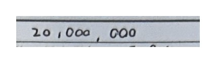
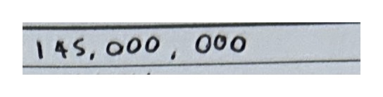
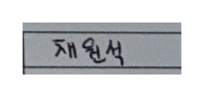
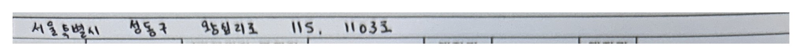
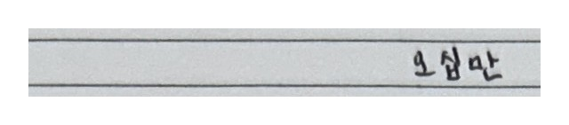
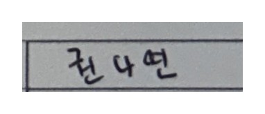
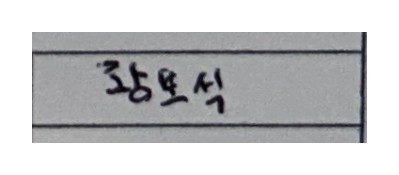
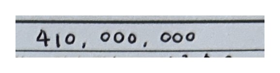
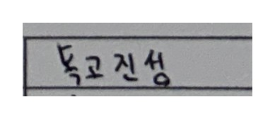

# 대표 성공 / 실패 사례

이미지는 모두 GT ROI crop (`results/roi_gt/crops/`와 같은 파일, 위아래 25% 여유 + 흰 여백 포함).
Full OCR 열은 전체 페이지 OCR 결과를 같은 GT ROI에 글자 단위로 배정한 값 (`scripts/evaluate_fields.py`).

## A. ROI 재인식으로 해결된 사례

### A-1. 박스 병합 — 한글 금액과 숫자 금액이 한 박스로 합쳐짐 (`sample_10`, #10 멀리서 촬영)

| | 결과 |
|---|---|
| 정답 | `20,000,000` |
| Full OCR | 박스 원문 `이원만 원정(W 201000,000` → 필드 값 `201000000` ❌ |
| GT ROI OCR | `20,000,000` ✅ |

전체 페이지에서는 보증금 한글 칸, 인쇄 글자 `원정(W`, 숫자 칸이 한 박스로 검출됐다. 그 결과 쉼표(`,`)가 `1`로 읽혔고,
한글 금액과 숫자 금액의 경계도 흐려졌다. 칸만 잘라 인식하면 이 문맥 간섭이 사라진다.

### A-2. 박스 병합 + 인쇄 어긋남 (`sample_7`, #7 접힘)

| | 결과 |
|---|---|
| 정답 | `145,000,000` |
| Full OCR | 박스 원문 `일억사원9백 원정(W145,000,000` → 필드 값 `5000000` ❌ (박스 하나에 두 칸이 섞여 글자 단위로 나누다 앞자리 `14`가 잘림) |
| GT ROI OCR | `145,000,000` ✅ |

### A-3. 같은 글씨인데 문맥에 따라 다르게 읽음 (`sample_10`, 임대인 성명)

| | 결과 |
|---|---|
| 정답 | `채원석` |
| Full OCR | `재원석` ❌ |
| GT ROI OCR | `채원석` ✅ |

## B. 두 방법 모두 실패 (인식 모델의 손글씨 한계)

### B-1. 소재지 — 10장 모두 Exact Match 실패 (`sample_9`, #8)

| | 결과 |
|---|---|
| 정답 | `서울특별시 성동구 왕십리로 115, 1103호` |
| Full OCR | `서울토별시성동구95십리13I1S11033` (CER 높음) |
| GT ROI OCR | `서울토별시성동국9심리311511033` |

긴 손글씨 주소는 ROI로 잘라도 해결되지 않는다. `특`→`토`, `왕`→`9`, `로`→`3`, `호`→`3` 같은 글자 단위 오인식이 원인이다.
위치(ROI)가 아니라 인식 모델(mobile 한국어 rec)의 손글씨 성능 문제이며, 10장 평균 CER은 0.316에서 0.270으로 약간만 줄었다.

### B-2. 손글씨 `오` 오인식 (`sample_5`, #6 계약금)

| | 결과 |
|---|---|
| 정답 | `오십만` |
| Full OCR | `소십만` ❌ |
| GT ROI OCR | `요심만` ❌ |

`오`는 10장 전체에서 `9` / `소` / `요` / `1` / `3` 등으로 가장 자주 틀린 글자다.
보증금 한글 칸 Exact Match가 두 방법 모두 2/10에 그친 주원인이다.

### B-3. 기입자 필체 자체가 모호 (`sample_5`, 임차인 성명 / `sample_6`, 임대인 성명)

 

| 정답 | Full OCR | GT ROI OCR |
|---|---|---|
| `권나연` | `권4연` ❌ | `권4연` ❌ |
| `황보석` | `3모식` ❌ | `중요식` ❌ |

`나`를 `4`처럼, `황`을 좁게 눌러 썼다. 사람이 봐도 헷갈리는 수준이라 OCR만으로는 한계가 있다.
(정답은 의도한 값 기준이다.)

## C. ROI 재인식이 오히려 나빠진 사례

### C-1. 위아래 여유 때문에 다음 행 글자 조각이 섞임 (`sample_8`, #9 보증금 숫자)

| | 결과 |
|---|---|
| 정답 | `410,000,000` |
| Full OCR | `410000000` ✅ |
| GT ROI OCR | `410,000,000 0` → `4100000000` ❌ |

손글씨가 칸 선을 넘는 경우를 위해 위아래로 25% 여유를 줬다. 그런데 이 장에서는 아래 행 인쇄 글자의 윗부분 조각이
crop 하단에 걸렸고, 그 조각이 `0`으로 인식됐다. 여유 비율을 줄이거나, 인식 결과에서 crop 가장자리에 걸친 작은 박스를
제거하는 후처리가 필요하다.

### C-2. 같은 글씨를 다르게 읽음 (`sample_8`, 임차인 성명)

| | 결과 |
|---|---|
| 정답 | `독고진성` |
| Full OCR | `독고진성` ✅ |
| GT ROI OCR | `특고진성` ❌ |
